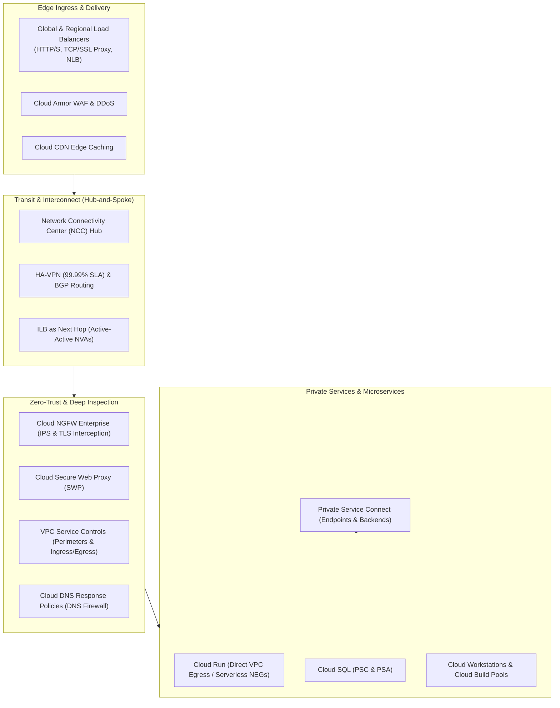
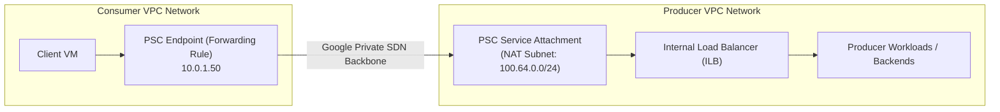
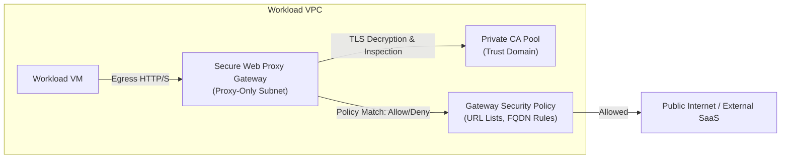
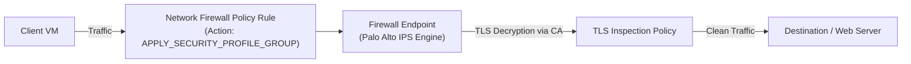
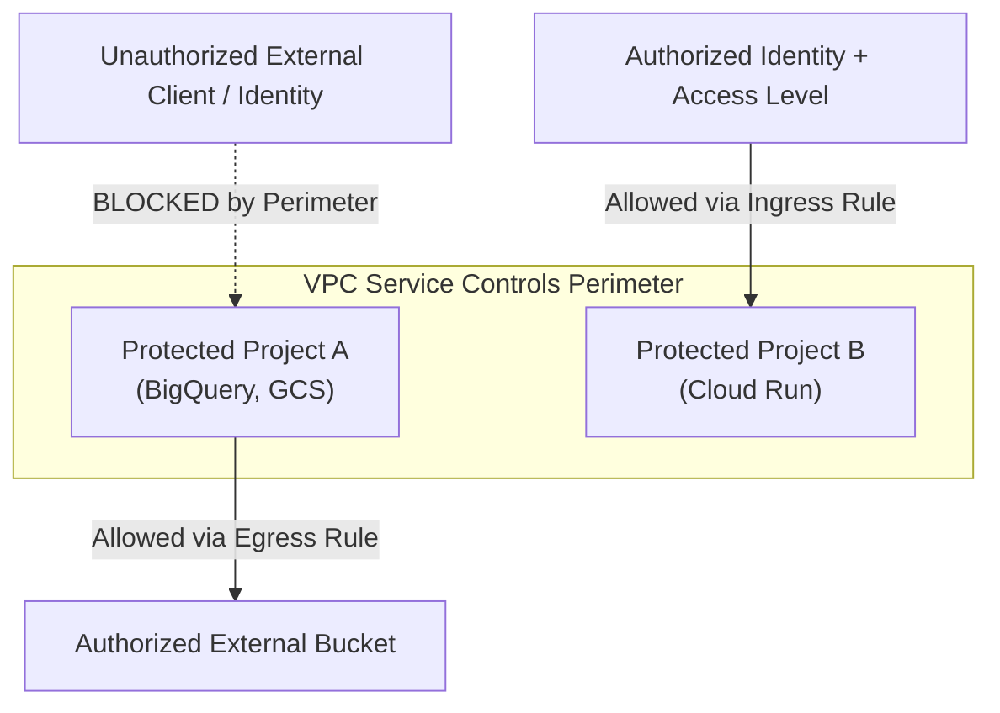
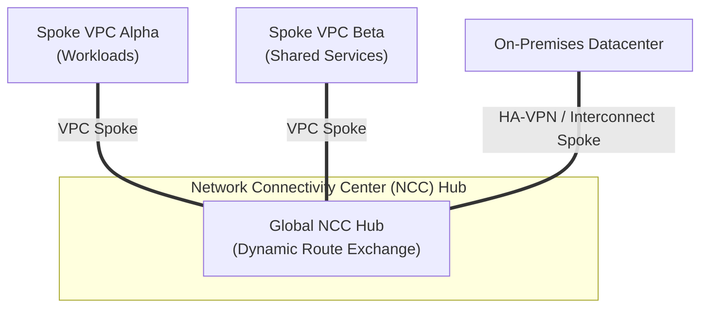
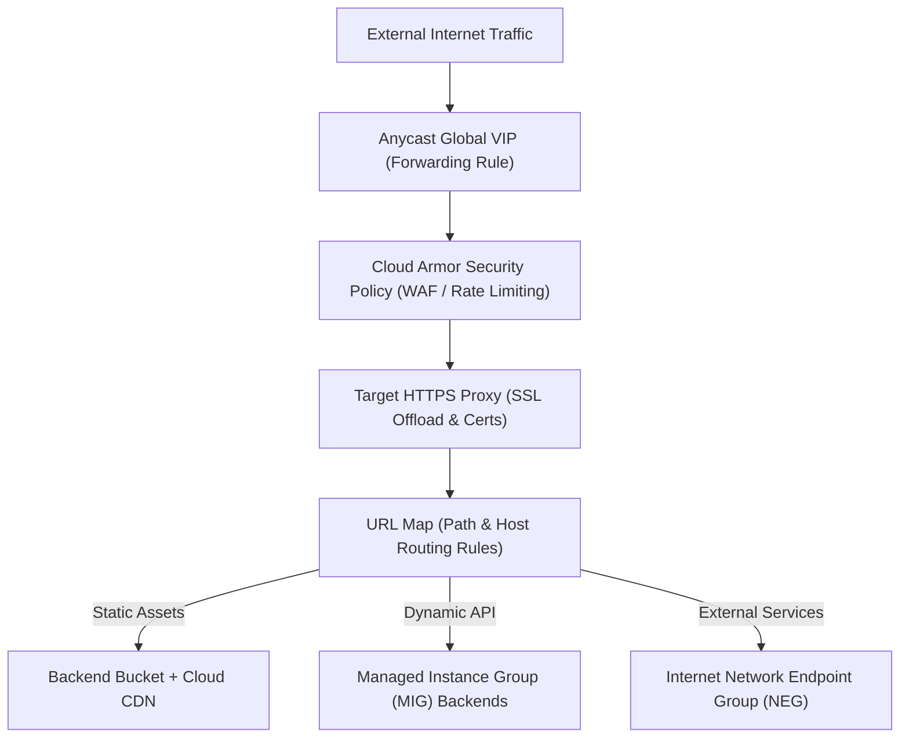
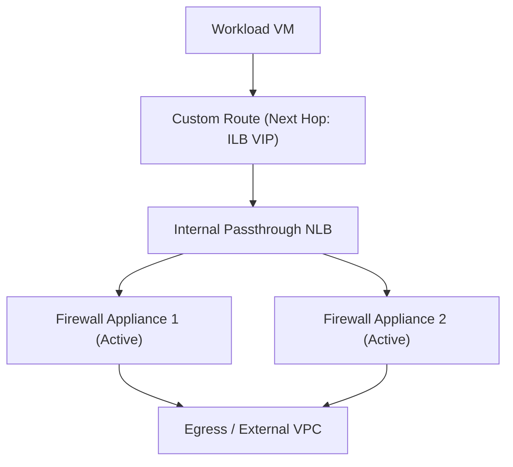
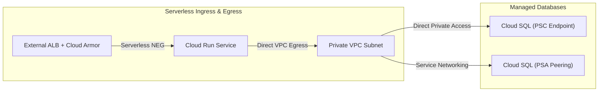
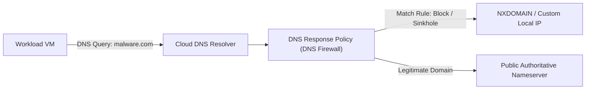

# Google Cloud Platform (GCP) Advanced Networking Terraform Suite

A comprehensive, production-grade catalog of Terraform reference architectures and implementations for Google Cloud Platform (GCP) networking. This repository covers zero-trust network security, private service connectivity, hybrid transit routing, next-generation firewall inspection, modern application delivery, and serverless networking.

---

## Table of Contents

- [Executive Architecture Overview](#executive-architecture-overview)
- [Repository Design Standards & Conventions](#repository-design-standards--conventions)
- [Core Foundation Modules (`modules/`)](#core-foundation-modules-modules)
- [Domain-Driven Architectural Directory Catalog](#domain-driven-architectural-directory-catalog)
  - [1. Private Service Connect (PSC) Suite](#1-private-service-connect-psc-suite)
  - [2. Cloud Secure Web Proxy (SWP) & Egress Security](#2-cloud-secure-web-proxy-swp--egress-security)
  - [3. Cloud Next-Generation Firewall (NGFW Enterprise & TLS)](#3-cloud-next-generation-firewall-ngfw-enterprise--tls)
  - [4. VPC Service Controls (VPC-SC) Zero-Trust Perimeters](#4-vpc-service-controls-vpc-sc-zero-trust-perimeters)
  - [5. Network Connectivity Center (NCC) & Hybrid Transit Networks](#5-network-connectivity-center-ncc--hybrid-transit-networks)
  - [6. Load Balancing, Content Delivery & Cloud Armor](#6-load-balancing-content-delivery--cloud-armor)
  - [7. Advanced Routing, Next-Hop ILB & Network Virtual Appliances (NVA)](#7-advanced-routing-next-hop-ilb--network-virtual-appliances-nva)
  - [8. Serverless & Managed PaaS Connectivity](#8-serverless--managed-paas-connectivity)
  - [9. Cloud DNS & Security Response Policies](#9-cloud-dns--security-response-policies)
  - [10. Foundational VPC & Compute Baselines](#10-foundational-vpc--compute-baselines)
- [Enterprise Deployment & Operations Guide](#enterprise-deployment--operations-guide)

---

## Executive Architecture Overview

This repository provides modular, production-ready Infrastructure-as-Code (IaC) solutions across every tier of the Google Cloud networking stack. It is designed to help enterprise cloud architects, network engineers, and security specialists implement and validate complex topologies.



---

## Repository Design Standards & Conventions

1. **Declarative Object-Driven Inputs**: Reusable modules consume structured HCL maps and objects (`vpcs`, `fw_rules`, `virtual_machines`, `dns_rp_rules`) to separate configuration data from resource logic.
2. **Deterministic & Collision-Free Resource Naming**: All sample topologies use `random_id` resources to append short hex hashes to GCP resource names (`namesuffix`), avoiding name collisions during testing.
3. **Multi-Project Architecture**: Distinct provider aliases and project IDs model enterprise separation between **Shared VPC Host Projects**, **Service Projects**, **PSC Consumer Projects**, and **PSC Producer Projects**.
4. **Zero-Public-IP Compute Workloads**: All test and compute VMs reside on private subnets without public IPs. Egress is provided via Cloud NAT and administrative access is secured via Identity-Aware Proxy (IAP) TCP forwarding (`35.235.240.0/20`).
5. **Proxy-Only Subnets**: L7 Load Balancers and Secure Web Proxy Gateways utilize dedicated active and backup subnets with purpose `REGIONAL_MANAGED_PROXY` or `GLOBAL_MANAGED_PROXY`.

---

## Core Foundation Modules (`modules/`)

The [`modules/`](file:///Users/justyngreen/Repos/Google/Demos/gcp-networking-demos/modules) directory provides core building blocks used across the repository.

| Module | Location | Purpose | Key GCP Resources |
|---|---|---|---|
| **VPC Foundation** | [`modules/google-infra-vpc`](file:///Users/justyngreen/Repos/Google/Demos/gcp-networking-demos/modules/google-infra-vpc) | Provisions Custom VPC networks, subnets, secondary ranges (GKE), proxy-only subnets, Cloud Routers, Cloud NAT, and Private DNS zones. | `google_compute_network`, `google_compute_subnetwork`, `google_compute_router`, `google_compute_router_nat`, `google_dns_managed_zone` |
| **Compute VM Instances** | [`modules/google-infra-vms`](file:///Users/justyngreen/Repos/Google/Demos/gcp-networking-demos/modules/google-infra-vms) | Provisions Compute Engine instances with automated startup scripts, metadata, network interfaces, IP assignment, and OS Login. | `google_compute_instance`, `google_compute_instance_template`, `google_compute_project_metadata` |
| **Traditional Firewalls** | [`modules/google-infra-firewall`](file:///Users/justyngreen/Repos/Google/Demos/gcp-networking-demos/modules/google-infra-firewall) | Provisions traditional VPC firewall rules from JSON/HCL maps supporting ingress/egress, source/target tags, and priority ranges. | `google_compute_firewall` |
| **Hierarchical Firewall Policy** | [`modules/google-infra-fw-policy`](file:///Users/justyngreen/Repos/Google/Demos/gcp-networking-demos/modules/google-infra-fw-policy) | Provisions Modern Network and Hierarchical Firewall Policies with Layer 3/4 rule enforcement, secure tags, and network associations. | `google_compute_network_firewall_policy`, `google_compute_network_firewall_policy_rule`, `google_compute_network_firewall_policy_association` |

---

## Domain-Driven Architectural Directory Catalog

Below is an exhaustive technical catalog detailing each of the **69 sub-directories** in this repository, structured across 10 architectural domains.

---

### 1. Private Service Connect (PSC) Suite

Private Service Connect enables private, unidirectional consumption of services across independent VPC networks and organizations without IP overlap or VPC peering constraints.



| Folder | Pattern & Purpose | Reason for Use & Business Value | Key Resources & Modules |
|---|---|---|---|
| [`psc-googleapis`](file:///Users/justyngreen/Repos/Google/Demos/gcp-networking-demos/psc-googleapis) | **PSC Endpoint for Google APIs with Private DNS**<br/>Deploys a global forwarding rule pointing to `all-apis` / `vpc-sc` bundle with private Cloud DNS zone mapping `*.googleapis.com` to the PSC IP. | Eliminates reliance on default internet gateways or external IPs to reach Google APIs, keeping all API traffic strictly within private RFC 1918 addresses. | `google_compute_global_address`, `google_compute_global_forwarding_rule`, `google_dns_managed_zone`, [`google-infra-vpc`](file:///Users/justyngreen/Repos/Google/Demos/gcp-networking-demos/modules/google-infra-vpc) |
| [`psc-apis-private-route`](file:///Users/justyngreen/Repos/Google/Demos/gcp-networking-demos/psc-apis-private-route) | **PSC for Google APIs with Custom Static Routing**<br/>Demonstrates routing Google API traffic to PSC forwarding rules using custom route tables and private DNS response overrides. | Enables granular routing policies for Google API calls across multi-region networks without modifying global DNS resolvers. | `google_compute_global_forwarding_rule`, `google_compute_route`, `google_dns_response_policy`, [`google-infra-vpc`](file:///Users/justyngreen/Repos/Google/Demos/gcp-networking-demos/modules/google-infra-vpc) |
| [`psc-endpoints-tcp`](file:///Users/justyngreen/Repos/Google/Demos/gcp-networking-demos/psc-endpoints-tcp) | **Standard L4 TCP Published Service Consumption**<br/>Creates an Internal TCP/UDP Load Balancer with a PSC Service Attachment in a Producer VPC, consumed via a PSC Forwarding Rule in a Consumer VPC. | Allows SaaS providers and central platforms to publish internal microservices to consumers without requiring transitive routing or risking subnet overlap. | `google_compute_service_attachment`, `google_compute_forwarding_rule`, `google_compute_region_backend_service`, [`google-infra-vms`](file:///Users/justyngreen/Repos/Google/Demos/gcp-networking-demos/modules/google-infra-vms) |
| [`psc-endpoints-tcp-service-directory`](file:///Users/justyngreen/Repos/Google/Demos/gcp-networking-demos/psc-endpoints-tcp-service-directory) | **PSC Endpoints with Service Directory Integration**<br/>Registers PSC TCP endpoints into Google Cloud Service Directory for automated DNS resolution across multiple consumer projects. | Provides automated service discovery and centralized name resolution across multiple consumer VPCs consuming the same service attachment. | `google_compute_service_attachment`, `google_compute_forwarding_rule`, `google_service_directory_namespace`, `google_service_directory_service` |
| [`psc-backends-https`](file:///Users/justyngreen/Repos/Google/Demos/gcp-networking-demos/psc-backends-https) | **Application Load Balancer with PSC NEG Backends (HTTPS)**<br/>Implements an External or Internal Application Load Balancer that routes traffic to a producer service using PSC Network Endpoint Groups (PSC NEGs). | Enables layer-7 traffic management (URL rewriting, header routing, Cloud Armor, SSL offloading) in front of private producer services. | `google_compute_region_network_endpoint_group`, `google_compute_region_backend_service`, `google_compute_region_url_map`, `google_compute_service_attachment` |
| [`psc-backends-multiport`](file:///Users/justyngreen/Repos/Google/Demos/gcp-networking-demos/psc-backends-multiport) | **Multi-Port PSC Backend Forwarding**<br/>Demonstrates exposing multiple TCP ports (e.g. 80, 443, 8080) through a single PSC Service Attachment and PSC NEG backend structure. | Reduces operational overhead by consolidating multi-port microservices under unified service attachments instead of creating discrete endpoints per port. | `google_compute_service_attachment`, `google_compute_region_network_endpoint_group`, `google_compute_forwarding_rule`, [`google-infra-vms`](file:///Users/justyngreen/Repos/Google/Demos/gcp-networking-demos/modules/google-infra-vms) |
| [`psc-endpoints-cloudrun-globalbackends`](file:///Users/justyngreen/Repos/Google/Demos/gcp-networking-demos/psc-endpoints-cloudrun-globalbackends) | **Global ALB Fronting Cloud Run via PSC NEGs**<br/>Uses a Global External Application Load Balancer connected to regional Cloud Run services published via regional PSC Service Attachments. | Delivers global Anycast IP ingress, SSL termination, and Cloud Armor protection to serverless Cloud Run services while keeping them private. | `google_cloud_run_v2_service`, `google_compute_service_attachment`, `google_compute_global_forwarding_rule`, `google_compute_backend_service` |
| [`psc-endpoints-cloudrun-multiregion`](file:///Users/justyngreen/Repos/Google/Demos/gcp-networking-demos/psc-endpoints-cloudrun-multiregion) | **Multi-Region Private Cloud Run via PSC Endpoints**<br/>Provisions regional Cloud Run services across multiple GCP regions and publishes each via regional PSC endpoints for private internal consumption. | Establishes low-latency, multi-region private consumption of serverless applications from VPC workloads across geographical boundaries. | `google_cloud_run_v2_service`, `google_compute_service_attachment`, `google_compute_forwarding_rule`, `google_dns_managed_zone` |
| [`psc-l4-proxy-chaining-internet-neg`](file:///Users/justyngreen/Repos/Google/Demos/gcp-networking-demos/psc-l4-proxy-chaining-internet-neg) | **PSC to L4 TCP Proxy to Internet NEG Chaining**<br/>Connects a consumer VPC via PSC endpoint to a producer VPC containing an Internal TCP Proxy LB that routes out to an Internet NEG. | Implements a secure outbound egress gateway where consumer VPCs route to third-party public SaaS APIs via a centralized, controlled egress hub. | `google_compute_region_target_tcp_proxy`, `google_compute_region_network_endpoint_group`, `google_compute_service_attachment`, `google_compute_forwarding_rule` |
| [`psc-l7-shared-vpc`](file:///Users/justyngreen/Repos/Google/Demos/gcp-networking-demos/psc-l7-shared-vpc) | **PSC L7 ALB Architecture in Shared VPC**<br/>Implements PSC endpoints and service attachments in a multi-project Shared VPC environment separating Host and Service Projects. | Enforces enterprise organization boundaries: Host project network administrators manage VPC attachments while Service project teams manage workloads. | `google_compute_service_attachment`, `google_compute_region_network_endpoint_group`, `google_compute_region_url_map`, [`google-infra-vpc`](file:///Users/justyngreen/Repos/Google/Demos/gcp-networking-demos/modules/google-infra-vpc) |
| [`psc-multi-nic`](file:///Users/justyngreen/Repos/Google/Demos/gcp-networking-demos/psc-multi-nic) | **Multi-NIC Security Appliance with PSC Attachments**<br/>Deploys multi-NIC virtual appliances bridging consumer and producer networks, exposing the appliance via PSC service attachments. | Allows third-party firewall appliances or inspection engines to offer 'Inspection-as-a-Service' to downstream consumer VPCs. | `google_compute_instance_template`, `google_compute_service_attachment`, `google_compute_region_backend_service`, [`google-infra-vms`](file:///Users/justyngreen/Repos/Google/Demos/gcp-networking-demos/modules/google-infra-vms) |
| [`psc-portmap`](file:///Users/justyngreen/Repos/Google/Demos/gcp-networking-demos/psc-portmap) | **PSC Port Mapping Forwarding Architecture**<br/>Demonstrates PSC port mapping features that route consumer destination ports to dedicated, non-matching producer backend ports. | Simplifies migration and consolidation by translating consumer-standard ports directly to proprietary producer backend listener ports. | `google_compute_forwarding_rule`, `google_compute_service_attachment`, `google_compute_region_network_endpoint_group`, `google_compute_region_target_tcp_proxy` |

---

### 2. Cloud Secure Web Proxy (SWP) & Egress Security

Google Cloud Secure Web Proxy provides scalable, cloud-native HTTP/HTTPS forward proxying for egress traffic without requiring manual proxy VM infrastructure.



| Folder | Pattern & Purpose | Reason for Use & Business Value | Key Resources & Modules |
|---|---|---|---|
| [`secure-web-proxy`](file:///Users/justyngreen/Repos/Google/Demos/gcp-networking-demos/secure-web-proxy) | **Multi-Region Cloud Secure Web Proxy with TLS Inspection**<br/>Deploys regional SWP gateways with Gateway Security Policies, URL Lists, Certificate Manager certificates, and Private CA pools for TLS decryption. | Secures outbound internet egress by enforcing URL-level filtering, blocking malicious domains, and performing deep TLS inspection on encrypted traffic. | `google_network_services_gateway`, `google_network_security_gateway_security_policy`, `google_network_security_tls_inspection_policy`, `google_privateca_certificate_authority` |
| [`swp-multi-project`](file:///Users/justyngreen/Repos/Google/Demos/gcp-networking-demos/swp-multi-project) | **Centralized SWP with Multi-Project VPC-SC Integration**<br/>Provisions a central SWP gateway in a security hub project and routes egress from multiple protected projects inside a VPC-SC perimeter. | Enables centralized corporate egress governance and compliance monitoring across isolated business unit projects. | `google_network_services_gateway`, `google_access_context_manager_service_perimeter`, `google_compute_network_peering`, `google_certificate_manager_certificate` |
| [`swp-next-hop`](file:///Users/justyngreen/Repos/Google/Demos/gcp-networking-demos/swp-next-hop) | **Transparent SWP Egress using Custom Next-Hop Routes**<br/>Configures VPC custom routes that direct outbound internet traffic directly to the SWP gateway as the next hop without explicit client proxy configs. | Eliminates the need to configure explicit HTTP/HTTPS proxy environment variables or PAC files on client operating systems. | `google_compute_route`, `google_network_services_gateway`, `google_network_security_gateway_security_policy_rule`, [`google-infra-vms`](file:///Users/justyngreen/Repos/Google/Demos/gcp-networking-demos/modules/google-infra-vms) |
| [`swp-psc`](file:///Users/justyngreen/Repos/Google/Demos/gcp-networking-demos/swp-psc) | **Secure Web Proxy as a Service via PSC Attachment**<br/>Publishes a central SWP gateway through a PSC Service Attachment, allowing spoke VPCs to consume proxy services across private links. | Solves multi-tenant hub-and-spoke egress without requiring transitive VPC peering or shared routing tables. | `google_compute_service_attachment`, `google_network_services_gateway`, `google_compute_forwarding_rule`, `google_certificate_manager_certificate` |
| [`swp-psc-sni-multi-region`](file:///Users/justyngreen/Repos/Google/Demos/gcp-networking-demos/swp-psc-sni-multi-region) | **Multi-Region SWP with PSC & SNI Hostname Routing**<br/>Combines multi-region SWP deployments with PSC endpoints and Server Name Indication (SNI) matching rules for domain-based egress isolation. | Delivers geo-redundant egress inspection with high performance and fine-grained domain-level whitelisting. | `google_network_services_gateway`, `google_compute_service_attachment`, `google_compute_forwarding_rule`, `google_network_security_gateway_security_policy` |

---

### 3. Cloud Next-Generation Firewall (NGFW Enterprise & TLS)

Cloud NGFW Enterprise brings Palo Alto Networks threat prevention and intrusion prevention (IPS) directly into Google Cloud's distributed SDN layer without deploying virtual appliances.



| Folder | Pattern & Purpose | Reason for Use & Business Value | Key Resources & Modules |
|---|---|---|---|
| [`cloud-ngfw-enterprise`](file:///Users/justyngreen/Repos/Google/Demos/gcp-networking-demos/cloud-ngfw-enterprise) | **Cloud NGFW Enterprise with IPS & Threat Prevention**<br/>Configures organization/project firewall endpoints, security profile groups, and network firewall policies with Layer 7 intrusion prevention. | Protects VPC workloads from CVE exploits, malware delivery, spyware, and command-and-control (C2) attacks inline without appliance bottlenecks. | `google_network_security_security_profile_group`, `google_network_security_security_profile`, `google_compute_network_firewall_policy_rule`, `google_compute_firewall_endpoint` |
| [`cloud-ngfw-ent-tls`](file:///Users/justyngreen/Repos/Google/Demos/gcp-networking-demos/cloud-ngfw-ent-tls) | **Cloud NGFW Enterprise with TLS Decryption & Inspection**<br/>Integrates Cloud NGFW Enterprise with Private Certificate Authority Service (CAS) and Certificate Manager to decrypt and inspect inbound/outbound TLS sessions. | Closes the visibility gap on encrypted traffic, enabling IPS inspection and threat signature matching on encrypted HTTPS payloads. | `google_network_security_tls_inspection_policy`, `google_privateca_certificate_authority`, `google_certificate_manager_certificate`, `google_network_security_security_profile_group` |
| [`cloud-ngfw-ent-tls-temp`](file:///Users/justyngreen/Repos/Google/Demos/gcp-networking-demos/cloud-ngfw-ent-tls-temp) | **NGFW Enterprise TLS Validation & Codelab Harness**<br/>A turnkey test bed providing client/server compute instances and verification scripts to validate TLS decryption and IPS blocking. | Accelerates proof-of-concept testing and compliance verification for enterprise security architects. | `google_network_security_tls_inspection_policy`, `google_privateca_certificate_authority`, `google_compute_instance`, `google_compute_network_firewall_policy` |

---

### 4. VPC Service Controls (VPC-SC) Zero-Trust Perimeters

VPC Service Controls establishes cryptographic security perimeters around Google Cloud managed services (Cloud Storage, BigQuery, Cloud Run) to prevent data exfiltration.



| Folder | Pattern & Purpose | Reason for Use & Business Value | Key Resources & Modules |
|---|---|---|---|
| [`vpc-sc`](file:///Users/justyngreen/Repos/Google/Demos/gcp-networking-demos/vpc-sc) | **Foundational Multi-Project VPC-SC Perimeter**<br/>Creates Access Context Manager access policies, service perimeters enclosing protected projects, and sets restricted services (`storage.googleapis.com`, `bigquery.googleapis.com`). | Hardens sensitive workloads against data exfiltration by disallowing access to resources outside authorized project boundaries. | `google_access_context_manager_access_policy`, `google_access_context_manager_service_perimeter`, `google_storage_bucket`, `google_dns_response_policy` |
| [`vpc-sc-anz-test`](file:///Users/justyngreen/Repos/Google/Demos/gcp-networking-demos/vpc-sc-anz-test) | **Enterprise Perimeter Testing & SA Impersonation**<br/>Implements perimeter access rules using dynamically created Service Accounts with Token Creator roles to validate perimeter boundaries. | Provides an automated verification test suite to ensure service accounts and human operators cannot breach perimeters without access levels. | `google_access_context_manager_service_perimeter_ingress_policy`, `google_service_account`, `google_project_iam_member`, [`google-infra-vpc`](file:///Users/justyngreen/Repos/Google/Demos/gcp-networking-demos/modules/google-infra-vpc) |
| [`vpc-sc-ingress-egress`](file:///Users/justyngreen/Repos/Google/Demos/gcp-networking-demos/vpc-sc-ingress-egress) | **Directional Ingress & Egress Perimeter Rules**<br/>Configures granular perimeter ingress and egress rules to allow specific identities to invoke Cloud Run or read Cloud Storage across perimeter boundaries. | Enables secure data exchange between distinct perimeters without having to bridge or dissolve the perimeters. | `google_access_context_manager_service_perimeter_ingress_policy`, `google_cloud_run_v2_service`, `google_access_context_manager_access_level`, [`google-infra-vms`](file:///Users/justyngreen/Repos/Google/Demos/gcp-networking-demos/modules/google-infra-vms) |
| [`vpc-sc-multi-vpc`](file:///Users/justyngreen/Repos/Google/Demos/gcp-networking-demos/vpc-sc-multi-vpc) | **Multi-VPC Perimeter Architecture with Serverless**<br/>Combines multiple VPC networks and serverless Cloud Run endpoints under coordinated perimeter enforcement. | Demonstrates how large enterprises maintain perimeter isolation across heterogeneous network infrastructures. | `google_access_context_manager_service_perimeter`, `google_cloud_run_v2_service`, `google_compute_instance`, [`google-infra-vpc`](file:///Users/justyngreen/Repos/Google/Demos/gcp-networking-demos/modules/google-infra-vpc) |
| [`vpc-sc-service-patterns`](file:///Users/justyngreen/Repos/Google/Demos/gcp-networking-demos/vpc-sc-service-patterns) | **Standard Enterprise VPC-SC Topologies**<br/>Demonstrates DMZ perimeters, Shared Services perimeters, and perimeter bridges for enterprise governance. | Implements standard reference architectures recommended in the Google Cloud Architecture Framework. | `google_access_context_manager_access_policy`, `google_access_context_manager_service_perimeter`, `google_dns_response_policy`, `google_compute_instance` |
| [`vpc-sc-swp-test`](file:///Users/justyngreen/Repos/Google/Demos/gcp-networking-demos/vpc-sc-swp-test) | **Egress Inspection from within VPC-SC Perimeters**<br/>Validates outbound internet and API egress through Cloud Secure Web Proxy from workloads enclosed inside an active VPC-SC perimeter. | Ensures egress inspection compliance without triggering false-positive perimeter violation alerts. | `google_access_context_manager_service_perimeter`, `google_network_services_gateway`, `google_network_security_tls_inspection_policy`, `google_privateca_certificate_authority` |

---

### 5. Network Connectivity Center (NCC) & Hybrid Transit Networks

Network Connectivity Center (NCC) serves as Google Cloud's centralized transit hub, interconnecting VPC networks, VPNs, and third-party SD-WAN routers across the global network.



| Folder | Pattern & Purpose | Reason for Use & Business Value | Key Resources & Modules |
|---|---|---|---|
| [`ncc-vpc-hub-spoke`](file:///Users/justyngreen/Repos/Google/Demos/gcp-networking-demos/ncc-vpc-hub-spoke) | **NCC Hub with Direct VPC Spokes**<br/>Deploys an NCC Hub and registers multiple VPC networks as VPC Spokes, enabling full-mesh dynamic IP route exchange without VPC Peering. | Eliminates the 25-peering limit and transitive routing restrictions of classic VPC peering, allowing dynamic VPC-to-VPC routing at scale. | `google_network_connectivity_hub`, `google_network_connectivity_spoke`, `google_compute_network`, `google_compute_subnetwork` |
| [`ncc-vpc-ilbs`](file:///Users/justyngreen/Repos/Google/Demos/gcp-networking-demos/ncc-vpc-ilbs) | **NCC Hub with ILB Next-Hop Inspection Routing**<br/>Combines NCC VPC Spokes with Internal Load Balancer Next Hop routes to steer inter-spoke traffic through a centralized firewall cluster. | Delivers centralized, active-active security inspection for all inter-VPC traffic managed by NCC. | `google_network_connectivity_hub`, `google_network_connectivity_spoke`, `google_compute_forwarding_rule`, `google_compute_route` |
| [`ncc-vpc-swp`](file:///Users/justyngreen/Repos/Google/Demos/gcp-networking-demos/ncc-vpc-swp) | **NCC Hub Integrated with Centralized Egress SWP**<br/>Connects multiple workload spoke VPCs through an NCC Hub to a centralized Secure Web Proxy egress VPC. | Consolidates outbound egress logging, threat filtering, and TLS inspection into a single managed hub for all spokes. | `google_network_connectivity_hub`, `google_network_connectivity_spoke`, `google_network_services_gateway`, `google_network_security_gateway_security_policy` |
| [`ncc-hub-spoke-multi-nic`](file:///Users/justyngreen/Repos/Google/Demos/gcp-networking-demos/ncc-hub-spoke-multi-nic) | **NCC with Centralized Multi-NIC NVA Appliances**<br/>Integrates multi-NIC firewall appliances directly with NCC spokes for granular traffic separation between trust zones. | Allows enterprise firewalls (Fortinet, Palo Alto, Check Point) to inspect multi-VPC transit traffic dynamically. | `google_network_connectivity_hub`, `google_network_connectivity_spoke`, `google_compute_instance`, [`google-infra-vms`](file:///Users/justyngreen/Repos/Google/Demos/gcp-networking-demos/modules/google-infra-vms) |
| [`ncc-peering-ilbanh`](file:///Users/justyngreen/Repos/Google/Demos/gcp-networking-demos/ncc-peering-ilbanh) | **NCC with Peering & BIRD Dynamic BGP ILB-ANH**<br/>Implements active-active NVA routing using BIRD BGP software routers, NCC dynamic route exchange, and ILB Next Hops. | Delivers self-healing, dynamic multi-path routing between on-premises simulated environments and cloud spokes. | `google_network_connectivity_hub`, `google_compute_forwarding_rule`, `google_compute_route`, [`google-infra-vms`](file:///Users/justyngreen/Repos/Google/Demos/gcp-networking-demos/modules/google-infra-vms) |
| [`ha-vpn`](file:///Users/justyngreen/Repos/Google/Demos/gcp-networking-demos/ha-vpn) | **High Availability Cloud VPN (99.99% SLA)**<br/>Deploys dual HA-VPN gateways with active-active redundant IPsec tunnels and dynamic BGP session peering. | Provides enterprise-grade, encrypted hybrid connectivity between on-premises datacenters or cloud providers with automated failover. | `google_compute_ha_vpn_gateway`, `google_compute_vpn_tunnel`, `google_compute_router`, `google_compute_router_peer` |
| [`ha-vpn-ncc-spokes`](file:///Users/justyngreen/Repos/Google/Demos/gcp-networking-demos/ha-vpn-ncc-spokes) | **HA-VPN Attached as an NCC VPN Spoke**<br/>Registers HA-VPN tunnels into an NCC Hub alongside VPC spokes, dynamically propagating on-premises BGP routes to all cloud spokes. | Creates seamless, automated hybrid routing from on-premises to all VPC spokes without managing individual route tables. | `google_network_connectivity_hub`, `google_network_connectivity_spoke`, `google_compute_ha_vpn_gateway`, `google_compute_router` |
| [`ha-vpn-vpc-peering`](file:///Users/justyngreen/Repos/Google/Demos/gcp-networking-demos/ha-vpn-vpc-peering) | **HA-VPN with Custom Peering Route Exchange**<br/>Combines HA-VPN hybrid tunnels with VPC Peering using `export_custom_routes` and `import_custom_routes` flags. | Enables non-transitive VPC peering networks to reach on-premises networks across a transit hub VPC. | `google_compute_network_peering`, `google_compute_ha_vpn_gateway`, `google_compute_router`, [`google-infra-vpc`](file:///Users/justyngreen/Repos/Google/Demos/gcp-networking-demos/modules/google-infra-vpc) |
| [`flexiwan-ncc`](file:///Users/justyngreen/Repos/Google/Demos/gcp-networking-demos/flexiwan-ncc) | **SD-WAN Router Appliance Integration with NCC**<br/>Provisions flexiWAN SD-WAN virtual appliances and connects them as NCC Router Appliance Spokes via BGP peering to Cloud Routers. | Extends corporate SD-WAN fabric directly into Google Cloud, providing optimized branch-to-cloud connectivity. | `google_network_connectivity_hub`, `google_network_connectivity_spoke`, `google_compute_router`, [`google-infra-vms`](file:///Users/justyngreen/Repos/Google/Demos/gcp-networking-demos/modules/google-infra-vms) |

---

### 6. Load Balancing, Content Delivery & Cloud Armor

Google Cloud's software-defined load balancers provide Anycast IP edge routing, autoscaling, SSL termination, and DDoS protection across global and regional tiers.



| Folder | Pattern & Purpose | Reason for Use & Business Value | Key Resources & Modules |
|---|---|---|---|
| [`gclb-cloud-armor-mig`](file:///Users/justyngreen/Repos/Google/Demos/gcp-networking-demos/gclb-cloud-armor-mig) | **Global External ALB + Cloud Armor WAF + MIG**<br/>Deploys a Global External Application Load Balancer with Cloud Armor WAF rules protecting autoscaled Managed Instance Groups (MIG). | Defends web applications against OWASP Top 10 vulnerabilities, botnets, and DDoS attacks with automated backend scaling. | `google_compute_security_policy`, `google_compute_global_forwarding_rule`, `google_compute_backend_service`, `terraform-google-modules/vm/google//modules/mig` |
| [`gclb-cloud-armor-uig`](file:///Users/justyngreen/Repos/Google/Demos/gcp-networking-demos/gclb-cloud-armor-uig) | **Global External ALB + Cloud Armor WAF + UIG**<br/>Deploys a Global ALB fronting static Unmanaged Instance Groups (UIG) with Cloud Armor filtering. | Protects legacy or stateful VM instances that cannot run inside autoscaling managed instance groups. | `google_compute_security_policy`, `google_compute_instance_group`, `google_compute_backend_service`, [`google-infra-vms`](file:///Users/justyngreen/Repos/Google/Demos/gcp-networking-demos/modules/google-infra-vms) |
| [`gclb-resource-http`](file:///Users/justyngreen/Repos/Google/Demos/gcp-networking-demos/gclb-resource-http) | **Global HTTP/HTTPS LB Advanced URL Mapping**<br/>Demonstrates complex URL maps with multiple host rules, path matchers, header-based routing, and backend services. | Consolidates multiple microservices and domain routing rules under a single IP and SSL certificate infrastructure. | `google_compute_url_map`, `google_compute_target_http_proxy`, `google_compute_backend_service`, [`google-infra-vms`](file:///Users/justyngreen/Repos/Google/Demos/gcp-networking-demos/modules/google-infra-vms) |
| [`gclb-shared-vpc`](file:///Users/justyngreen/Repos/Google/Demos/gcp-networking-demos/gclb-shared-vpc) | **Global External ALB Deployed in Shared VPC**<br/>Provisions load balancing frontend components in a Shared VPC Host project while instance backends reside in separate Service Projects. | Enforces organizational separation of duties between central network operations and application development teams. | `google_compute_global_forwarding_rule`, `google_compute_backend_service`, `google_compute_instance_group`, [`google-infra-vpc`](file:///Users/justyngreen/Repos/Google/Demos/gcp-networking-demos/modules/google-infra-vpc) |
| [`alb-regional-shared-vpc`](file:///Users/justyngreen/Repos/Google/Demos/gcp-networking-demos/alb-regional-shared-vpc) | **Regional Application Load Balancer in Shared VPC**<br/>Implements Regional L7 ALB using regional proxy-only subnets across Shared VPC Host and Service projects. | Meets strict data residency and jurisdiction compliance by guaranteeing all traffic processing remains within a single GCP region. | `google_compute_forwarding_rule`, `google_compute_region_backend_service`, `google_compute_region_url_map`, [`google-infra-vpc`](file:///Users/justyngreen/Repos/Google/Demos/gcp-networking-demos/modules/google-infra-vpc) |
| [`cloud-cdn`](file:///Users/justyngreen/Repos/Google/Demos/gcp-networking-demos/cloud-cdn) | **Global External ALB with Cloud CDN Acceleration**<br/>Configures Cloud CDN caching on backend services and storage buckets with custom cache keys, TTL policies, and negative caching. | Drastically reduces origin server load and accelerates global static asset delivery via Google's edge points of presence (PoPs). | `google_compute_backend_service`, `google_compute_backend_bucket`, `google_compute_url_map`, `google_compute_global_forwarding_rule` |
| [`l7-ilb`](file:///Users/justyngreen/Repos/Google/Demos/gcp-networking-demos/l7-ilb) | **Regional Internal Application Load Balancer (HTTP)**<br/>Deploys a regional Envoy-based Internal HTTP Load Balancer with proxy-only subnets and URL routing rules. | Provides high-performance internal layer-7 microservice routing, load distribution, and health checking inside the VPC. | `google_compute_forwarding_rule`, `google_compute_region_backend_service`, `google_compute_region_url_map`, `google_compute_region_target_http_proxy` |
| [`l7-ilb-https`](file:///Users/justyngreen/Repos/Google/Demos/gcp-networking-demos/l7-ilb-https) | **Regional Internal HTTPS Load Balancer with SSL**<br/>Implements an Internal HTTPS Load Balancer with regional SSL certificates, proxy-only subnets, and Cloud DNS private records. | Enforces end-to-end zero-trust encryption in transit for internal enterprise microservices. | `google_compute_region_ssl_certificate`, `google_compute_region_target_https_proxy`, `google_dns_managed_zone`, `google_dns_record_set` |
| [`l4-ext-tcp-proxy`](file:///Users/justyngreen/Repos/Google/Demos/gcp-networking-demos/l4-ext-tcp-proxy) | **Global External TCP Proxy Load Balancer**<br/>Terminates client TCP connections at Google's global Anycast edge and proxies traffic over Google's private backbone to backend MIGs. | Enhances connection setup times for non-HTTP protocols (gaming, database replication, IoT) across global users. | `google_compute_target_tcp_proxy`, `google_compute_global_forwarding_rule`, `google_compute_backend_service`, `terraform-google-modules/vm/google//modules/mig` |
| [`l4-internal-tcp-proxy`](file:///Users/justyngreen/Repos/Google/Demos/gcp-networking-demos/l4-internal-tcp-proxy) | **Regional Internal TCP Proxy Load Balancer**<br/>Regional Envoy-based Internal TCP Proxy load balancer using proxy-only subnets for internal TCP services. | Enables advanced internal TCP traffic management, connection draining, and non-HTTP health checking. | `google_compute_region_target_tcp_proxy`, `google_compute_forwarding_rule`, `google_compute_region_backend_service`, [`google-infra-vms`](file:///Users/justyngreen/Repos/Google/Demos/gcp-networking-demos/modules/google-infra-vms) |
| [`l4-nlb`](file:///Users/justyngreen/Repos/Google/Demos/gcp-networking-demos/l4-nlb) | **Regional Passthrough Network Load Balancer (NLB)**<br/>Implements a high-throughput, low-latency Maglev-based L4 passthrough load balancer that preserves client source IP addresses. | Ideal for high-performance UDP/TCP workloads, firewall appliances, and real-time streaming where source IP preservation is mandatory. | `google_compute_forwarding_rule`, `google_compute_region_backend_service`, `google_compute_region_health_check`, [`google-infra-vms`](file:///Users/justyngreen/Repos/Google/Demos/gcp-networking-demos/modules/google-infra-vms) |
| [`internet-global-neg`](file:///Users/justyngreen/Repos/Google/Demos/gcp-networking-demos/internet-global-neg) | **Global External ALB with Internet NEGs**<br/>Configures Global External ALB routing to external public endpoints (FQDNs/IPs) outside Google Cloud using Internet NEGs. | Brings Google Cloud Armor security, SSL offloading, and Anycast CDN caching in front of legacy on-premises or third-party web apps. | `google_compute_global_network_endpoint_group`, `google_compute_global_network_endpoint`, `google_compute_backend_service`, `google_compute_url_map` |
| [`internet-regional-neg-fqdn`](file:///Users/justyngreen/Repos/Google/Demos/gcp-networking-demos/internet-regional-neg-fqdn) | **Regional External ALB with FQDN Internet NEGs**<br/>Deploys a Regional External ALB routing to external domains via FQDN-based Regional Internet Network Endpoint Groups. | Provides regional edge ingress and routing to external third-party services while maintaining regional data compliance. | `google_compute_region_network_endpoint_group`, `google_compute_region_network_endpoint`, `google_compute_region_backend_service`, `google_compute_forwarding_rule` |
| [`tcp-proxy-hybrid-neg`](file:///Users/justyngreen/Repos/Google/Demos/gcp-networking-demos/tcp-proxy-hybrid-neg) | **TCP Proxy Load Balancer with Hybrid NEGs over HA-VPN**<br/>Terminates TCP connections in GCP and routes traffic to on-premises IP backends via Hybrid Connectivity NEGs over HA-VPN. | Modernizes on-premises non-HTTP legacy services by placing Google's resilient Anycast edge in front of on-prem datacenters. | `google_compute_network_endpoint_group`, `google_compute_network_endpoint`, `google_compute_region_backend_service`, `terraform-google-modules/vpn/google//modules/vpn_ha` |

---

### 7. Advanced Routing, Next-Hop ILB & Network Virtual Appliances (NVA)

Advanced routing architectures leverage Internal Load Balancers as Next Hops (ILB-ANH) to build horizontally scalable, active-active firewall inspection fabrics.



| Folder | Pattern & Purpose | Reason for Use & Business Value | Key Resources & Modules |
|---|---|---|---|
| [`hub-spoke-ilbanh`](file:///Users/justyngreen/Repos/Google/Demos/gcp-networking-demos/hub-spoke-ilbanh) | **Hub-and-Spoke Topology with ILB as Next Hop (ILB-ANH)**<br/>Implements custom VPC routes pointing to an Internal Load Balancer VIP as the next hop for active-active NVA scaling. | Enables seamless horizontal scaling and health-checked failover of third-party firewalls without complex BGP configurations. | `google_compute_route`, `google_compute_forwarding_rule`, `google_compute_region_backend_service`, [`google-infra-vms`](file:///Users/justyngreen/Repos/Google/Demos/gcp-networking-demos/modules/google-infra-vms) |
| [`ilb-multinic-appliance`](file:///Users/justyngreen/Repos/Google/Demos/gcp-networking-demos/ilb-multinic-appliance) | **Multi-NIC Virtual Appliance Routing Architecture**<br/>Configures dual-NIC compute instances bridging trust and untrust VPCs with symmetric routing and health checks. | Essential for deploying traditional enterprise firewalls requiring discrete management, trusted, and untrusted network interfaces. | `google_compute_instance`, `google_compute_forwarding_rule`, `google_compute_route`, `google_compute_subnetwork` |
| [`ilb-regional-route`](file:///Users/justyngreen/Repos/Google/Demos/gcp-networking-demos/ilb-regional-route) | **Regional Static Routing to Internal Load Balancers**<br/>Demonstrates multi-region static route configurations directing specific destination CIDRs to regional ILB endpoints. | Provides predictable, deterministic traffic steering across multiple regional inspection clusters. | `google_compute_route`, `google_compute_forwarding_rule`, `google_compute_region_backend_service`, `google_dns_response_policy` |
| [`canva-hub-spoke-test`](file:///Users/justyngreen/Repos/Google/Demos/gcp-networking-demos/canva-hub-spoke-test) | **Large-Scale Multi-Spoke Routing Benchmark**<br/>Deploys a multi-VPC transit topology designed to test high-throughput transitive routing and cross-spoke latency. | Used for benchmarking performance, stress-testing firewall throughput, and validating routing scalability. | `google_compute_network_peering`, `google_compute_route`, `google_compute_instance`, [`google-infra-vpc`](file:///Users/justyngreen/Repos/Google/Demos/gcp-networking-demos/modules/google-infra-vpc) |
| [`internal-ranges`](file:///Users/justyngreen/Repos/Google/Demos/gcp-networking-demos/internal-ranges) | **Dynamic IP Allocation with NCC Internal Ranges**<br/>Uses `google_network_connectivity_internal_range` to reserve, manage, and dynamically allocate subnets across NCC hubs. | Solves enterprise IP address management (IPAM) fragmentation by dynamically carving and advertising CIDRs across VPCs. | `google_network_connectivity_internal_range`, `google_network_connectivity_hub`, `google_network_connectivity_spoke`, `google_compute_network` |

---

### 8. Serverless & Managed PaaS Connectivity

Connects serverless compute (Cloud Run), managed databases (Cloud SQL), developer environments (Cloud Workstations), and CI/CD pipelines (Cloud Build) securely into private VPC fabrics.



| Folder | Pattern & Purpose | Reason for Use & Business Value | Key Resources & Modules |
|---|---|---|---|
| [`cloud-run-cloud-armor-alb`](file:///Users/justyngreen/Repos/Google/Demos/gcp-networking-demos/cloud-run-cloud-armor-alb) | **Cloud Run Protected by External ALB & Cloud Armor WAF**<br/>Connects an External ALB with Cloud Armor WAF rules to Cloud Run using Serverless NEGs, enforcing `internal-and-cloud-load-balancing` ingress. | Secures serverless web apps with DDoS protection, rate limiting, and geo-blocking while blocking direct access to `run.app` URLs. | `google_cloud_run_v2_service`, `google_compute_region_network_endpoint_group`, `google_compute_security_policy`, `google_compute_global_forwarding_rule` |
| [`cloud-run-direct-egress`](file:///Users/justyngreen/Repos/Google/Demos/gcp-networking-demos/cloud-run-direct-egress) | **Cloud Run Direct VPC Egress (Direct Network Interface)**<br/>Configures Cloud Run services with Direct VPC Egress, routing container outbound traffic straight into private VPC subnets. | Eliminates Serverless VPC Access Connector VM costs, increases throughput, and simplifies private database connectivity. | `google_cloud_run_v2_service`, `google_compute_subnetwork`, `google_compute_router_nat`, [`google-infra-vpc`](file:///Users/justyngreen/Repos/Google/Demos/gcp-networking-demos/modules/google-infra-vpc) |
| [`cloud-sql-psc-hybrid`](file:///Users/justyngreen/Repos/Google/Demos/gcp-networking-demos/cloud-sql-psc-hybrid) | **Cloud SQL Private Service Connect for Hybrid Networks**<br/>Provisions Cloud SQL with PSC service attachments, enabling private database queries from GCP VPCs and on-premises datacenters. | Overcomes Private Services Access (PSA) limitations, allowing database access across non-peered VPCs and complex hybrid WANs. | `google_sql_database_instance`, `google_compute_forwarding_rule`, `google_compute_ha_vpn_gateway`, [`google-infra-vms`](file:///Users/justyngreen/Repos/Google/Demos/gcp-networking-demos/modules/google-infra-vms) |
| [`cloud-sql-psa`](file:///Users/justyngreen/Repos/Google/Demos/gcp-networking-demos/cloud-sql-psa) | **Cloud SQL with Private Services Access (PSA)**<br/>Deploys Cloud SQL with Service Networking peering using reserved private IP CIDR ranges. | Standard reference implementation for enterprise workloads accessing Cloud SQL over traditional VPC peering. | `google_sql_database_instance`, `google_service_networking_connection`, `google_compute_global_address`, [`google-infra-vpc`](file:///Users/justyngreen/Repos/Google/Demos/gcp-networking-demos/modules/google-infra-vpc) |
| [`cloud-workstations`](file:///Users/justyngreen/Repos/Google/Demos/gcp-networking-demos/cloud-workstations) | **Secure Cloud Workstations Private Network Fabric**<br/>Provisions managed Cloud Workstations clusters inside dedicated private subnets with restricted egress and IAM security. | Delivers fully managed, secure remote developer environments that meet corporate zero-trust and intellectual property controls. | `google_workstations_workstation_cluster`, `google_workstations_workstation_config`, `google_compute_subnetwork`, [`google-infra-vpc`](file:///Users/justyngreen/Repos/Google/Demos/gcp-networking-demos/modules/google-infra-vpc) |
| [`cloudbuild-v2-env`](file:///Users/justyngreen/Repos/Google/Demos/gcp-networking-demos/cloudbuild-v2-env) | **Cloud Build v2 Private Worker Pools & Network Attachments**<br/>Sets up Cloud Build private pools connected to private VPC subnets to securely access internal artifact registries and code repositories. | Prevents source code and build artifacts from traversing public networks during automated CI/CD execution. | `google_cloudbuildv2_connection`, `google_cloudbuildv2_repository`, `google_compute_network_attachment`, `google_service_networking_connection` |
| [`temp-cloudrun-demo`](file:///Users/justyngreen/Repos/Google/Demos/gcp-networking-demos/temp-cloudrun-demo) | **Turnkey Cloud Run Demo Harness**<br/>Provides a complete testing harness deploying Cloud Run services with sample JSON payloads, IAM bindings, and regional load balancers. | Used for rapid prototyping and validation of Cloud Run networking patterns. | `google_cloud_run_v2_service`, `google_compute_region_network_endpoint_group`, `google_compute_forwarding_rule`, [`google-infra-vms`](file:///Users/justyngreen/Repos/Google/Demos/gcp-networking-demos/modules/google-infra-vms) |

---

### 9. Cloud DNS & Security Response Policies

Cloud DNS manages internal name resolution, hybrid forwarding, and security response policies (DNS Firewall) to block malicious domain lookups.



| Folder | Pattern & Purpose | Reason for Use & Business Value | Key Resources & Modules |
|---|---|---|---|
| [`dns-zone-response-policies`](file:///Users/justyngreen/Repos/Google/Demos/gcp-networking-demos/dns-zone-response-policies) | **Cloud DNS Response Policies (DNS Firewall)**<br/>Configures Cloud DNS Response Policies and rules that intercept, override, or sinkhole specific DNS domain queries across VPCs. | Blocks malware C2 domains, overrides public API addresses with private IPs, and enforces corporate DNS hygiene at the resolver layer. | `google_dns_response_policy`, `google_dns_response_policy_rule`, `google_compute_network`, [`google-infra-vms`](file:///Users/justyngreen/Repos/Google/Demos/gcp-networking-demos/modules/google-infra-vms) |
| [`dns-x-project-delegation`](file:///Users/justyngreen/Repos/Google/Demos/gcp-networking-demos/dns-x-project-delegation) | **Cross-Project Private DNS Zone Delegation & Peering**<br/>Implements centralized private DNS architectures where consumer project VPCs resolve records hosted in a central DNS hub project via DNS peering. | Eliminates duplicate DNS zone maintenance across projects and centralizes internal domain governance. | `google_dns_managed_zone`, `google_dns_record_set`, `google_compute_network`, [`google-infra-vpc`](file:///Users/justyngreen/Repos/Google/Demos/gcp-networking-demos/modules/google-infra-vpc) |

---

### 10. Foundational VPC & Compute Baselines

Foundational baselines for dual-stack IPv4/IPv6 networks, latency benchmarking, and reusable Terraform snippets.

| Folder | Pattern & Purpose | Reason for Use & Business Value | Key Resources & Modules |
|---|---|---|---|
| [`vpc-with-vms`](file:///Users/justyngreen/Repos/Google/Demos/gcp-networking-demos/vpc-with-vms) | **Standard Enterprise VPC Baseline with Compute VMs**<br/>Provisions a production-ready VPC network with public/private subnets, Cloud NAT, IAP access rules, and test compute instances. | Serves as the standard starting template for standing up clean, isolated GCP networking sandboxes. | `google_compute_network`, `google_compute_subnetwork`, `google_compute_router_nat`, [`google-infra-vpc`](file:///Users/justyngreen/Repos/Google/Demos/gcp-networking-demos/modules/google-infra-vpc) |
| [`compute-regions`](file:///Users/justyngreen/Repos/Google/Demos/gcp-networking-demos/compute-regions) | **Multi-Region Latency & Routing Measurement**<br/>Deploys compute instances across multiple global GCP regions connected to a global VPC network to benchmark cross-region latency. | Essential for capacity planning, selecting disaster recovery regions, and measuring Google backbone round-trip times. | `google_compute_instance`, `google_compute_subnetwork`, `google_compute_router_nat`, [`google-infra-vpc`](file:///Users/justyngreen/Repos/Google/Demos/gcp-networking-demos/modules/google-infra-vpc) |
| [`compute-regions-ipv6`](file:///Users/justyngreen/Repos/Google/Demos/gcp-networking-demos/compute-regions-ipv6) | **Dual-Stack IPv4 / IPv6 VPC Network Architecture**<br/>Configures dual-stack subnets with external and internal IPv6 allocations, IPv6 firewall rules, and dual-stack compute instances. | Prepares enterprises for IPv4 exhaustion and enables direct IPv6 communication for mobile, IoT, and global clients. | `google_compute_subnetwork`, `google_compute_firewall`, `google_compute_instance`, [`google-infra-vpc`](file:///Users/justyngreen/Repos/Google/Demos/gcp-networking-demos/modules/google-infra-vpc) |
| [`snippets`](file:///Users/justyngreen/Repos/Google/Demos/gcp-networking-demos/snippets) | **Reusable Terraform IaC Code Snippets**<br/>Contains reusable patterns, such as dynamically determining a project's parent Organization or Folder for Hierarchical Firewall Policies. | Provides drop-in logic snippets for complex Terraform state and metadata queries. | `google_compute_firewall_policy`, `google_project` data source |
| [`scratch`](file:///Users/justyngreen/Repos/Google/Demos/gcp-networking-demos/scratch) | **Prototyping & Ephemeral Testing Workspace**<br/>A sandbox directory pre-wired with foundation modules for rapidly validating experimental configurations before promotion. | Minimizes churn in production modules by providing a dedicated sandbox for one-off proof of concepts. | [`google-infra-vpc`](file:///Users/justyngreen/Repos/Google/Demos/gcp-networking-demos/modules/google-infra-vpc), [`google-infra-firewall`](file:///Users/justyngreen/Repos/Google/Demos/gcp-networking-demos/modules/google-infra-firewall), [`google-infra-vms`](file:///Users/justyngreen/Repos/Google/Demos/gcp-networking-demos/modules/google-infra-vms) |

---

## Enterprise Deployment & Operations Guide

### Prerequisites & Authentication

Ensure you have installed:
- **Terraform** >= 1.5.0
- **Google Cloud SDK (`gcloud`)** >= 450.0.0

Authenticate using Application Default Credentials (ADC):
```bash
gcloud auth login
gcloud auth application-default login
```

### Standard Deployment Workflow

1. Navigate to the desired pattern directory:
   ```bash
   cd psc-endpoints-tcp
   ```
2. Create and customize your `terraform.tfvars`:
   ```hcl
   project-id-consumer = "your-consumer-project-id"
   project-id-producer = "your-producer-project-id"
   region              = "us-central1"
   append_rand         = true
   ```
3. Initialize Terraform and apply the configuration:
   ```bash
   terraform init
   terraform plan -out=tfplan
   terraform apply tfplan
   ```

### Verification & Testing Runbook

#### 1. Verifying Private Service Connect (PSC)
SSH into the consumer VM using IAP and verify connectivity to the PSC Endpoint IP:
```bash
gcloud compute ssh <consumer-vm-name> --zone=<zone> --tunnel-through-iap --project=<project-id>
curl -v http://<psc-endpoint-ip>
```

#### 2. Validating Secure Web Proxy (SWP) Egress
From a workload VM, test allowed and blocked domains through the SWP gateway:
```bash
# Test allowed domain
curl -x http://<swp-ip>:443 https://example.com -Iv

# Test blocked domain (should return 403 Forbidden)
curl -x http://<swp-ip>:443 https://unauthorized-domain.com -Iv
```

#### 3. Validating VPC Service Controls Perimeters
Verify perimeter enforcement from inside and outside the perimeter:
```bash
# Outside perimeter (should fail with VPC-SC violation error)
gcloud storage ls gs://<protected-bucket-name>

# Inside perimeter (should succeed)
gcloud compute ssh <perimeter-vm> --zone=<zone> --tunnel-through-iap
gcloud storage ls gs://<protected-bucket-name>
```

---

## License & Contributing

Distributed under the Apache 2.0 License. See individual files for Google LLC copyright notices.
