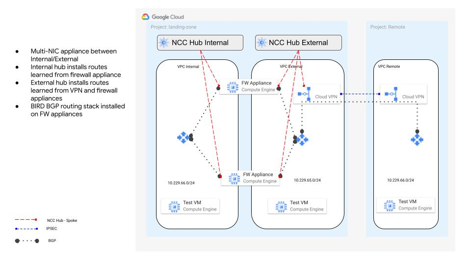

# Network Connectivity Center Multi-NIC

This Terraform code creates a network topology using two multi-NIC appliances between an internal and external VPC, using [BIRD](https://bird.network.cz/) for dynamic routing with Network Connectivity Center. The Remote VPC simulates an external client coming from on-premises.


The following describes the topology:




# Installation

- Edit variables.tf set the `project-id` variable to your project.

```
terraform init
terraform plan
terraform apply
```

# Usage

Note: All resources will have a random ID appended to them. This is so you can deploy to the same project multiple times.

# Variable Reference

| Name  | Type  | Required | Description |
|---|---|---|---|
| project-id | String | Yes | Project ID to deploy into |
| region | String | Yes | Google Cloud region to deploy into |
| cr_ext_asn | Number  | Yes | ASN of the Google Cloud Router for the external VPC |
| cr_int_asn | Number | Yes | ASN of the Google Cloud Router for the internal VPC |
| appliance_ext_asn | Number | Yes | ASN of the VM Appliances for the external VPC |
| appliance_int_asn | Number | No | ASN of the VM Appliances for the internal VPC |
| apis | List | Yes | List of Google APIs to enable |
| vpcs | Tuple | Yes | Used for the google-infra-vpc module. Specifies the VPC, subnet names/blocks/regions |
| fw_rules | Tuple | Yes | Used for the google-infra-firewall module. Specifies what VPC firewall rules to deploy |
| virtual_machines | Tuple | Yes | Used for the google-infra-vms module. Creates the test VMs. See the module's README for more details. |

# License

[](https://opensource.org/licenses/Apache-2.0)